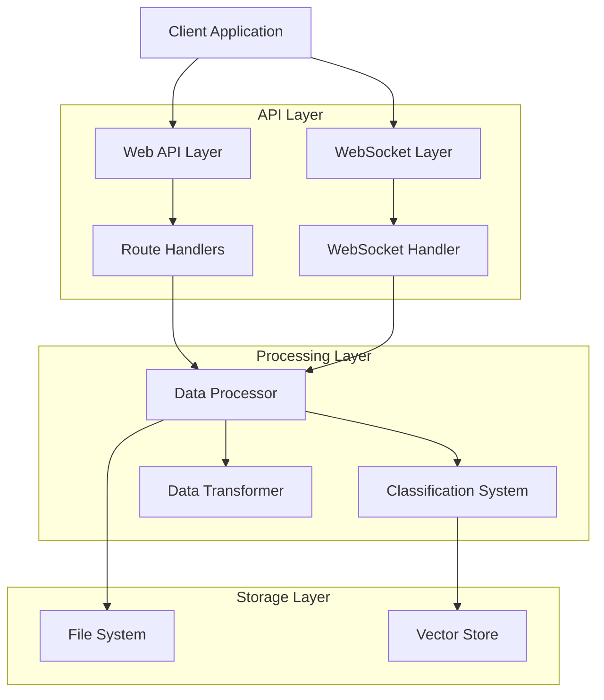
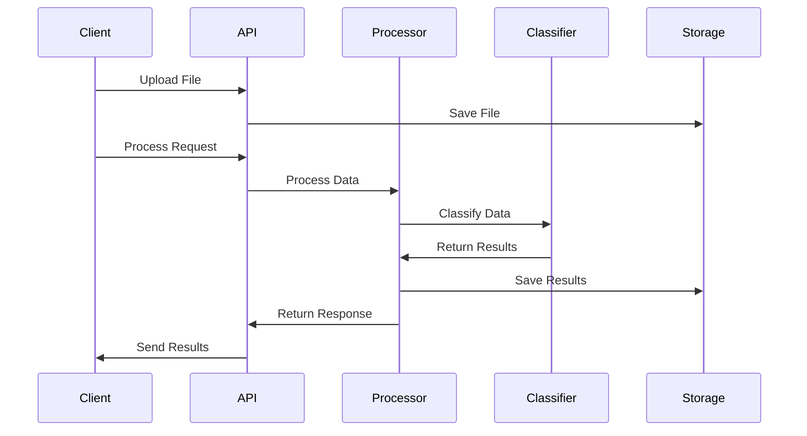
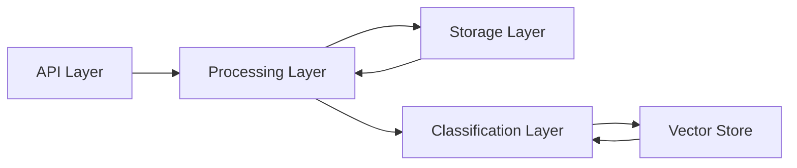
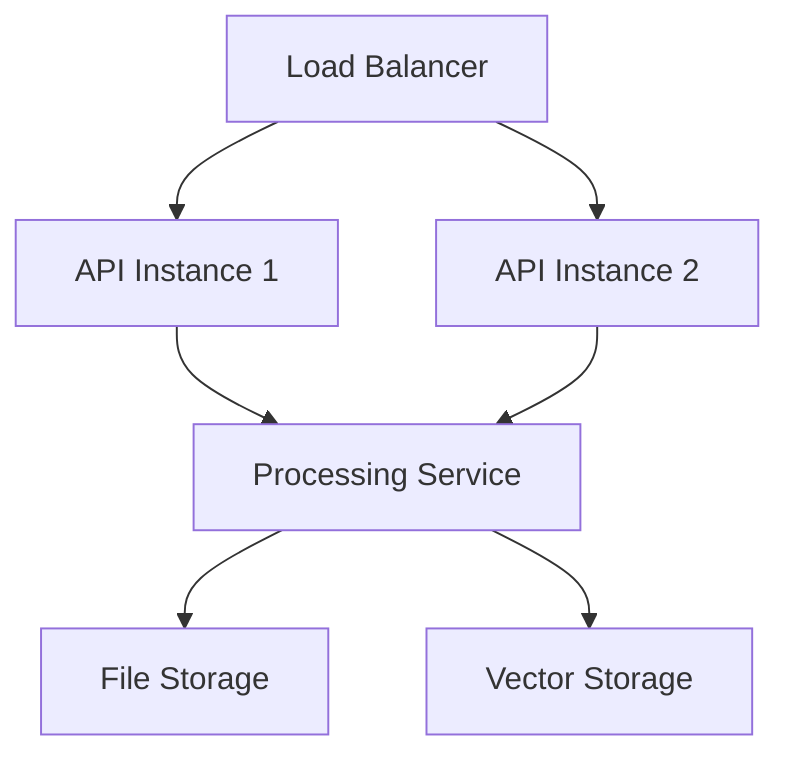
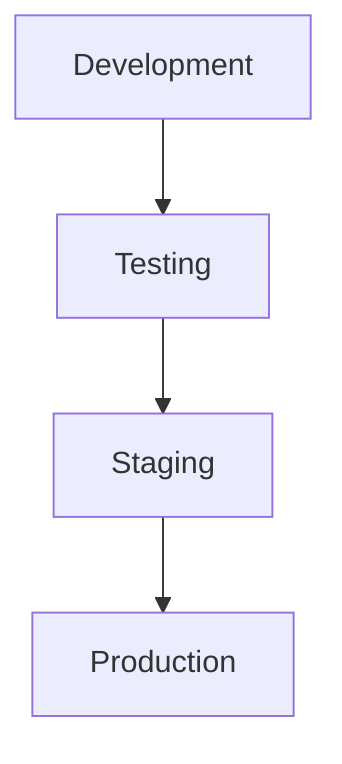

# Architecture Overview

## System Architecture

### High-Level Overview

The Creemson Engine is built on a modular architecture combining real-time processing capabilities with machine learning-based classification. The system is designed around the following core principles:

1. Asynchronous Processing
2. Modular Components
3. Scalable Design
4. Real-time Communication
5. Data Pipeline Architecture



## Core Components

### 1. API Layer

#### FastAPI Application
The main application server built with FastAPI:

```python
# src/common/api/api_client.py
app = FastAPI()
app.add_middleware(
    CORSMiddleware,
    allow_origins=["*"],
    allow_credentials=True,
    allow_methods=["*"],
    allow_headers=["*"],
)
```

#### WebSocket Communication
Real-time communication handler:

```python
# src/common/api/api_socket.py
async def websocket_endpoint(websocket: WebSocket):
    await websocket.accept()
    try:
        while True:
            data = await websocket.receive_json()
            result = await process_data(data)
            await websocket.send_json(result)
    except WebSocketDisconnect:
        logger.info("WebSocket disconnected")
```

### 2. Processing Layer

#### Data Processor
Handles the main data processing pipeline:

```python
class Processor:
    def __init__(self):
        self.classifier = Classifier()
        self.transformer = Transformer()
        
    async def process_file(self, filename: str, columns: List[int]):
        # Process data
        # Classify content
        # Transform results
        return results
```

#### Classification System
Machine learning-based classification:

```python
# src/engine/v1/classifiers/classifier.py
class Classifier:
    def __init__(self, nlp, genres, merchant_input, attrVal_per_attrGroup):
        self.nlp = nlp
        self.genres = genres
        self.merchant_input = merchant_input
        self.attrVal_per_attrGroup = attrVal_per_attrGroup
    
    def classify_genres(self, data: pd.DataFrame):
        # Implement classification logic
        return classifications
```

### 3. Storage Layer

#### File System Structure
```
data/
├── uploads/     # Temporary file storage
├── outputs/     # Processed results
└── input/       # Reference data
    ├── csv/
    ├── vector/
    └── utils/
```

## Data Flow Architecture

### 1. Request Flow



### 2. Processing Pipeline

1. **File Upload**
   ```python
   async def upload_file(file: UploadFile):
       file_path = save_file(file)
       return {"filename": file.filename}
   ```

2. **Column Selection**
   ```python
   async def get_columns(filename: str):
       df = pd.read_csv(filename)
       return get_input_columns(df)
   ```

3. **Data Processing**
   ```python
   async def process_file(filename: str, selected_columns: List[int]):
       # Load file
       # Process data
       # Generate outputs
       return results
   ```

## System Components Interaction

### 1. Component Communication



### 2. Data Transfer Protocol

```json
{
    "request": {
        "type": "process",
        "filename": "example.csv",
        "columns": [1, 2, 3]
    },
    "response": {
        "status": "success",
        "data": {
            "processed": true,
            "output_files": ["result.csv"]
        }
    }
}
```

## Technical Architecture Details

### 1. API Architecture

- **REST Endpoints**: File operations, data processing
- **WebSocket**: Real-time updates, progress monitoring
- **Authentication**: Token-based (if implemented)
- **Error Handling**: Standardized error responses

### 2. Processing Architecture

- **Async Processing**: Using Python's asyncio
- **Parallel Processing**: Multi-threaded operations
- **Memory Management**: Efficient data handling
- **Error Recovery**: Graceful error handling

### 3. Storage Architecture

- **File System**: Structured data storage
- **Vector Store**: Classification data
- **Temporary Storage**: Upload management
- **Output Management**: Result storage

## Performance Considerations

### 1. Optimization Strategies

- **Caching**: Frequently accessed data
- **Batch Processing**: Large dataset handling
- **Resource Management**: Memory and CPU usage
- **Connection Pooling**: Database connections

### 2. Scalability Design



## Security Architecture

### 1. Security Layers

1. **Network Security**
   - CORS configuration
   - SSL/TLS encryption
   - Rate limiting

2. **Application Security**
   - Input validation
   - File validation
   - Error handling

3. **Data Security**
   - File permissions
   - Data encryption
   - Secure storage

## Monitoring and Logging

### 1. Logging Architecture

```python
# src/engine/v1/utils/logconfig.py
logger = logging.getLogger(__name__)
logger.setLevel(logging.INFO)

handler = logging.StreamHandler()
handler.setFormatter(
    logging.Formatter('%(asctime)s - %(name)s - %(levelname)s - %(message)s')
)
logger.addHandler(handler)
```

### 2. Monitoring Points

- API requests/responses
- WebSocket connections
- Processing operations
- Classification performance
- Error occurrences

## Deployment Architecture

### 1. Development Environment



### 2. Production Environment

- Load balancing
- High availability
- Monitoring
- Backup systems

## Future Architecture Considerations

1. **Scalability**
   - Horizontal scaling
   - Load distribution
   - Resource optimization

2. **Integration**
   - External APIs
   - Additional services
   - New features

3. **Enhancement**
   - Performance improvements
   - Security updates
   - Feature additions

## Related Documentation

- [Project Structure](project-structure)
- [API Reference](api-reference)
- [Deployment Guide](deployment-guide)
- [Security Guide](security-best-practices)