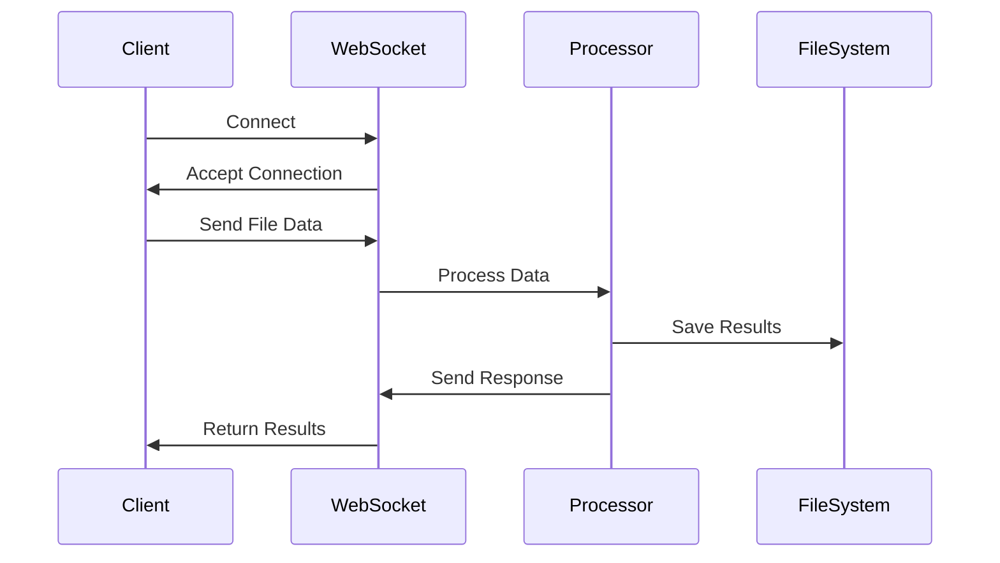

# WebSocket Communication

## Overview

The Creemson Engine implements WebSocket communication for real-time data processing and status updates. This document details the WebSocket implementation, protocols, and best practices.

## WebSocket Architecture

### Connection Handling

The WebSocket endpoint is implemented in `src/common/api/api_socket.py`:

```python
async def websocket_endpoint(websocket: WebSocket):
    await websocket.accept()
    try:
        while True:
            data = await websocket.receive_json()
            # Process WebSocket data
    except WebSocketDisconnect:
        logger.info("WebSocket disconnected")
```

### Message Flow



## Core Components

### 1. WebSocket Manager

```python
class WebSocketManager:
    def __init__(self):
        self.active_connections: List[WebSocket] = []

    async def connect(self, websocket: WebSocket):
        await websocket.accept()
        self.active_connections.append(websocket)

    async def disconnect(self, websocket: WebSocket):
        self.active_connections.remove(websocket)
```

### 2. Message Processing

Messages are processed asynchronously:

```python
async def process_websocket_message(websocket: WebSocket, data: dict):
    try:
        if 'filename' in data and 'selectedColumns' in data:
            result = await process_file(
                data['filename'], 
                data['selectedColumns']
            )
            await websocket.send_json({
                "type": "result",
                "data": result.dict()
            })
    except Exception as e:
        await websocket.send_json({
            "type": "error",
            "message": str(e)
        })
```

### 3. Error Handling

Comprehensive error handling is implemented:

```python
try:
    # Process WebSocket data
except WebSocketDisconnect:
    logger.info("WebSocket disconnected")
except json.JSONDecodeError:
    logger.error("Invalid JSON received")
except Exception as e:
    logger.error(f"WebSocket error: {str(e)}")
```

## Message Protocols

### 1. Request Format

```json
{
    "filename": "example.csv",
    "selectedColumns": [1, 2, 3]
}
```

### 2. Response Format

```json
{
    "type": "result",
    "data": {
        "summary": "File processed successfully",
        "output_data": {
            "rows": 100,
            "columns": ["col1", "col2"]
        }
    }
}
```

### 3. Error Format

```json
{
    "type": "error",
    "message": "Error processing file"
}
```

## Advanced Features

### 1. Connection Management

- Connection tracking
- Heartbeat monitoring
- Automatic reconnection
- Connection pooling

### 2. Data Streaming

Handling large data streams:

```python
async def stream_large_file(websocket: WebSocket, filename: str):
    chunk_size = 1024 * 1024  # 1MB chunks
    with open(filename, 'rb') as f:
        while chunk := f.read(chunk_size):
            await websocket.send_bytes(chunk)
```

### 3. State Management

Managing WebSocket state:

```python
class ConnectionState:
    def __init__(self):
        self.processing = False
        self.last_activity = None
        self.retry_count = 0
```

## Security Considerations

### 1. Connection Security

- TLS/SSL encryption
- Origin validation
- Authentication
- Rate limiting

### 2. Data Validation

```python
def validate_message(data: dict) -> bool:
    required_fields = ['filename', 'selectedColumns']
    return all(field in data for field in required_fields)
```

### 3. Resource Protection

- Message size limits
- Connection timeouts
- Resource cleanup

## Performance Optimizations

### 1. Connection Pooling

```python
class ConnectionPool:
    def __init__(self, max_size: int = 100):
        self.pool = asyncio.Queue(maxsize=max_size)
        self.active = 0
```

### 2. Message Batching

```python
async def batch_messages(messages: List[dict]):
    return {
        "type": "batch",
        "messages": messages
    }
```

### 3. Memory Management

Memory optimization strategies:
- Stream large files
- Implement cleanup routines
- Monitor memory usage

## Troubleshooting

### Common Issues

1. Connection Problems
   - Check network connectivity
   - Verify WebSocket URL
   - Check SSL/TLS configuration

2. Data Processing Issues
   - Validate message format
   - Check file permissions
   - Monitor server resources

3. Performance Issues
   - Review connection pool size
   - Check message batching
   - Monitor memory usage

## Error Codes and Messages

| Code | Message | Description |
|------|---------|-------------|
| 1001 | Connection Lost | WebSocket connection was lost |
| 1002 | Invalid Format | Message format is invalid |
| 1003 | Processing Error | Error during file processing |

## Best Practices

### 1. Connection Management
- Implement reconnection logic
- Handle disconnections gracefully
- Monitor connection health

### 2. Error Handling
- Provide detailed error messages
- Implement retry logic
- Log all errors

### 3. Testing
- Unit test message handling
- Test connection scenarios
- Perform load testing